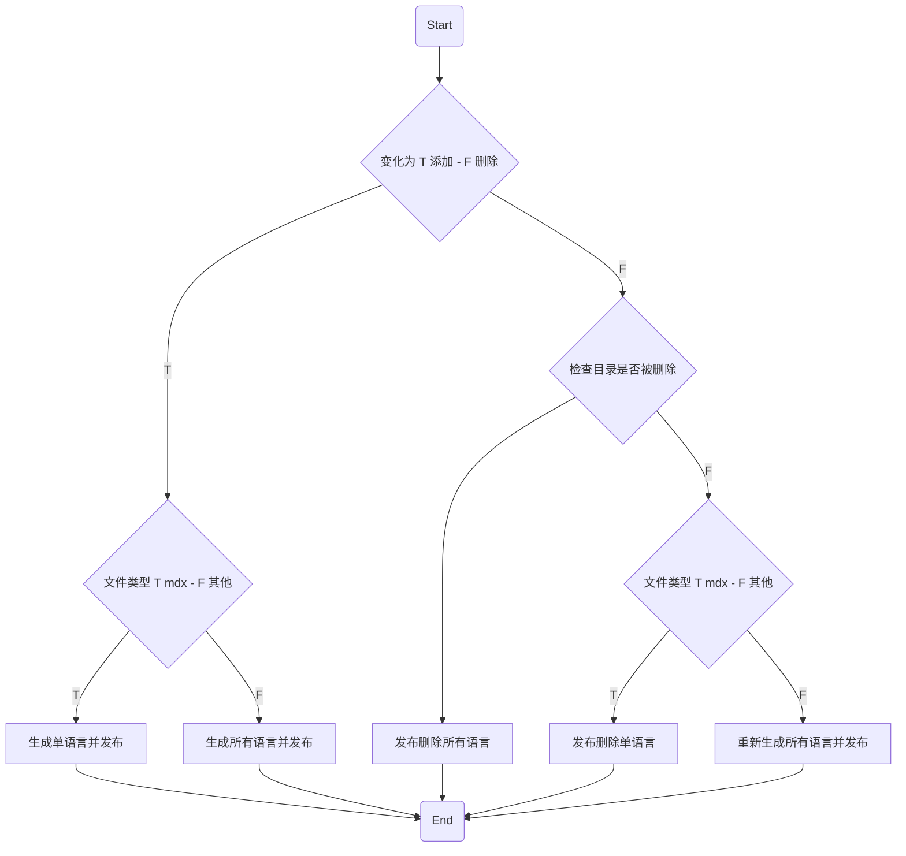

在博客沉寂了很久之后，我决定重新做一个。

- 初瘦： [v0.chat](https://v0.chat)
  - 2018 年
  - 用 Nuxt.js 框架封装了一个仅有 255 行代码的博客系统 [Nuxtpress](https://github.com/assholev0/nuxtpress)
- 《不可替代的团队领袖培养计划》： [leader.js.cool](https://leader.js.cool)
  - 2016 年
  - 先后用过 Gitbook、Docsify 和 Nuxt.js （Nuxt Content）
- 山沟沟： [sh.gg](https://sh.gg)
  - 2015 年
  - 使用的 Hexo 和 Next 主题，去年底换成了 Icarus Cyberpunk 主题，发布过 [Hexo Wordcount](https://github.com/willin/hexo-wordcount) 插件
- Willin.org、 Willin.me 等
  - 从 2009 年开始使用 Wordpress 搭建
  - 一直到 2015 年前后，不再使用自建服务器，改为纯静态化博客
- best02.cn、 Agean.com.cn 等
  - 从 2002 年起，使用过 Z-Blog、Emlog、Typecho 等各种博客系统去搭建动态博客

# 技术选型

|   项目   |          选择          |
| :------: | :--------------------: |
|   框架   |         Remix          |
|   部署   |    Cloudflare Pages    |
| 内容管理 | Cloudflare Workers KV  |
|   样式   | Tailwind CSS + DaisyUI |

## 技术框架

### Remix

Remix 是一个新的框架，更多的时候，可以与现有的 Next.js 进行横向对比。可以参考我之前的一些动态来了解：

- [如何评价 RemixJS 作者发布的《Remix vs Next.js》blog ?](https://www.zhihu.com/question/512297034/answer/2317035724)
- 《[相比于 Next.js 我更喜欢 Remix](https://blog.csdn.net/jslygwx/article/details/122308836)》
- 《[网站的未来： Next.js 与 Remix](https://blog.csdn.net/jslygwx/article/details/122186393)》

这里我就跳过 Next.js 的部分。

### Next.js 与 Nuxt.js

着重提一下 Nuxt.js，这就是为什么我需要重新做一个博客的主要原因，在我做这个决定的时候， Vue 3 正式版还没有更替（预计是今年 2022 的 2 月份）。 Nuxt.js 对于 Vue 3 的支持还不够完备。

同时由于现在所处的工作环境中，技术栈更多是偏向 React 的，所以我也需要在 React 方面多多预习，争取能跟上其他同事的步伐。

简单来说 Nuxt.js 就是 Next.js 的 Vue 版。

### Gatsby 与 Gridsome

虽然我很喜欢 GraphQL，但我不喜欢这样一种形式的使用。没有黑它（Gatsby）的意思，但我觉得真的不太行，吐槽它的话我能说一天一夜。

我努力过好几次，用 Gatsby 或者 Gridsome（也简单点来说， Gridsome 就是 Gatsby 的 Vue 版）来做一些现代点的尝试，但是都没有成功。从最后得到那一坨又一坨完全与优雅完全无关的代码来看，这一点都不现代。

## 部署方案

### Cloudflare Pages

免费（目前）中算是最快的了，Cloudflare YYDS。

优点：

- 每次提交部署，自动分配域名，可访问历史版本
- 部署可回滚
- 相较于 Cloudflare Workers 网站部署，不用把静态生成的文件存到 KV 中

缺点：

- Serverless 环境，不支持 `process`、 `fs` 等
- 非产品环境不支持绑定域名
- Workers 配置不支持 `toml` 配置文件
- Pages 后端的 Worker 服务于 Cloudflare Worker 直接使用有一些细节上的区别

### Cloudflare Workers

有足够用的免费量，升级后是 5 美元/月起步按量付费。

优点：

- 环境变量可以设置成隐藏
- 支持路由绑定、所有环境均可以绑定域名
- 可以设置计划任务（Cron Triggers）
- 实时日志

缺点：

- Serverless 环境，不支持 `process`、 `fs` 等
- 每个 Worker 仅代表一个环境（如产品环境和测试环境，需要分别创建两个 Worker）
- 不支持历史版本回滚

### Vercel

如果使用 Next.js 框架的话，与 Vercel 配合就非常合适。

优点：

- 支持 Node.js 环境
- 与 Cloudflare Pages 类似，有版本历史

缺点：

- 国内访问较慢
- 仅个人免费，团队开源项目也需要购买
- 免费版性能监控只支持 1 个项目

### Fly.io

Remix 官方推荐，但看了一眼价格，没有深入去了解。

优点：

- 容器部署，支持数据库

缺点：

- 国内访问较慢
- 定价较高

### 其他

如 Github Pages 之类的，不做赘述。

## 内容管理

使用 Markdown 来写作是一定必须的。以前我不知道 MDX，现在我忘不了它。

### 本地静态文件

快。免费。与灵活不沾边。

如果条件允许的话，我还是喜欢纯静态的。没有什么比静态更快了。当然我也会有一些动态的需求，比如站点评论、文章访问量等，最开始的时候 Vercel 各个条件都符合。

但使用 Vercel 的时候，我没有自己的数据库服务器，用云端数据库的话又怕影响性能以及后期会有较高的费用。所以作罢了。

### 键值对缓存

处于中间。既可以存文章内容这类静态内容，又可以存访问量、评论之类的动态数据。

提供免费服务的：

- Serverless Redis： [Upstash](https://upstash.com/)
- Cloudflare Workers KV

所以既然用了 Cloudflare，就全家桶一起上了。虽然 KV 比 Redis 缓存功能上差了一些，但好在它快吖。

### 数据库

贵。慢。灵活。

提供免费服务的，有两个不错的选择：

- Serverless MySQL： [PlantScale](https://planetscale.com/)
- Serverless DB： [Fauna](https://fauna.com/)

# MDX 内容管理

由于 Cloudflare Pages 后端是 Serverless 架构，无法使用 Node.js 的核心特性，如 `fs`、`process` 等，所以我是通过 KV 存储的方式来存放内容数据。通过 Git 提交，进行增量发布。线上环境可以像使用 Redis 缓存一样去直接读写 KV。

## KV 存储设计

KV Store 只有设置和删除键值对的基础功能。考虑到后续肯定会添加 i18n 国际化支持，所以一开始就将其考虑进去。

- 键名格式： `$locale:$type:$slug`
- 示例： `zh:posts:hello-world`

## 接口设计

由于创建只能单一创建，所以逻辑较为简单。删除则需要判断是单一删除还是批量删除。

### Interface

```ts
type Content = {
  type: string;
  slug: string;
  locale: string | boolean;
  deleted?: boolean;
  // 其他，如 frontmatter、code 等
};
```

### 创建接口

```ts
const { locale, slug, type } = data;
await CONTENTS.put([locale, type, slug].join(':'), JSON.stringify(data));
```

### 删除接口

如果指定了语言，则只删除一条。否则将所有语言下的 KV 内容均给删除掉。

```ts
const { locale, slug, type } = data;
if (locale) {
  await CONTENTS.delete([locale, type, slug].join(':'));
} else {
  await Promise.all(locales.map((locale) => CONTENTS.delete([locale, type, slug].join(':'))));
}
```

## 脚本部署

内容目录在 `content` 目录下。

### 全量扫描

如果第一次部署，或者变动对比（git diff）命令执行失败，则会进行全量部署。全量部署不涉及删除（如果需要清除历史数据重新部署，需要额外的操作）。

```ts
function getAllFiles() {
  const fileList = [];
  // `content/` 下面第一层目录代表类型，如 posts、pages
  // `content/` folders here are the types, like posts and pages
  const types = listFolders(CONTENT);
  types.forEach((type) => {
    // 下面第二层目录代表文章或页面的 slug
    // then sub folders are slugs of posts or pages
    const slugs = listFolders(path.join(CONTENT, type));
    slugs.forEach((slug) => {
      const files = fs.readdirSync(path.join(CONTENT, type, slug));
      files.forEach((file) => {
        // .mdx 文件名为语言代码， 如 en、 zh
        // content .mdx named with locale like en, zh
        if (file.endsWith('.mdx')) {
          fileList.push({
            type,
            slug,
            locale: file.replace(/\.mdx$/, ''),
            deleted: false
          });
        }
      });
    });
  });
  return fileList;
}
```

### 增量扫描

与全量类似，通过 `git diff` 命令比较，并返回相同格式的文件列表，如果出现异常，就返回全量数据。

### 列表遍历及操作

先将流程理顺，大概是这样子：



### MDX 编译

默认生成为 HTML，如果使用到了 jsx/tsx 才会生成为 Code。

```js
async function compileFile(file) {
  const { type, slug, locale } = file;
  const fileDir = path.join(CONTENT, type, slug);
  const filePath = path.join(fileDir, `${locale}.mdx`);
  const fileContent = await fsp.readFile(filePath, 'utf-8');
  let files = {};
  files = await fsp.readdir(fileDir).then((list) => list.filter((x) => !x.endsWith('.mdx')));
  const results = await Promise.all(files.map(async (filename) => fsp.readFile(path.join(fileDir, filename), 'utf8')));
  files = Object.fromEntries(results.map((content, i) => [`./${files[i]}`, content]));

  const { frontmatter, code } = await bundleMDX({
    source: fileContent,
    ...(Object.keys(files).length > 0 ? { files } : {}),
    xdmOptions(options) {
      // eslint-disable-next-line no-param-reassign
      options.rehypePlugins = [...(options.rehypePlugins ?? []), rehypeSlug, rehypeAutolinkHeadings];
      // eslint-disable-next-line no-param-reassign
      options.remarkPlugins = [
        ...(options.remarkPlugins ?? []),
        remarkGfm,
        [remarkGithub, { repository: 'willin/willin.wang' }],
        [
          remarkMermaid,
          {
            theme: 'dark'
          }
        ],
        [
          remarkCodeHike,
          {
            theme,
            lineNumbers: true
          }
        ]
      ];

      return options;
    }
  });

  const Component = getMdxComponent(code);
  const html = renderToString(createElement(Component));
  const hasComponents = true || Object.keys(files).length > 0;

  const hash = crypto
    .createHash('sha256')
    .update(frontmatter + code)
    .digest('hex');

  Object.assign(frontmatter, {
    readingTime: readingTime(fileContent)
  });
  return {
    hash,
    frontmatter,
    html,
    code: hasComponents ? code : undefined
  };
}
```

### Mermaid 插件

由于 `mdx-mermaid` 插件有效率和字体问题，所以重新写了一个简单的版本。

```js
import { parseFragment } from 'parse5';
import { fromParse5 } from 'hast-util-from-parse5';
import { visit } from 'unist-util-visit';
import { createElement } from 'react';
import { renderToString } from 'react-dom/server.js';

export default function remarkMermaid() {
  return (tree) => {
    visit(tree, { type: 'code', lang: 'mermaid' }, (node, index, parent) => {
      const div = createElement(
        'div',
        {
          className: 'mermaid'
        },
        node.value
      );
      const value = renderToString(div);

      parent.children.splice(index, 1, {
        type: 'div',
        children: [{ type: 'html', value }],
        data: { hChildren: [fromParse5(parseFragment(value))] }
      });
    });
  };
}
```

# 统计分析 Workers

计划为分别统计以下数据：

- Github 开源动态
- NPM 下载量
- Wakatime 代码动态
- Discord 活跃信息（无须 Workers）

# 其他

过年期间，草草上线了一个版本。具体已经实现的功能和后续的 TODO List 可以参考 [Roadmap](/roadmap)。

---

2022.02.18 补充。

今天，我又一次重构了博客系统。完全重新开始，并且将 Remix 版本提升到了 v1.2.1。

这一次，我抛弃了 Workers KV 存储，完全静态化。

先放上脚本：

```js
import path from 'path';
import fsp from 'fs/promises';
import { fileURLToPath } from 'url';
import matter from 'gray-matter';
import readingTime from 'reading-time';

// eslint-disable-next-line no-underscore-dangle
const __filename = fileURLToPath(import.meta.url);
// eslint-disable-next-line no-underscore-dangle
const __dirname = path.dirname(__filename);

const CONTENT = path.resolve(__dirname, '../content');
const OUTPUT = path.resolve(__dirname, '../public/_content');

const listFolders = (dir) =>
  fsp.readdir(dir, { withFileTypes: true }).then((files) => files.filter((f) => f.isDirectory()).map((f) => f.name));

const getAllFiles = async () => {
  const fileList = [];
  // `content/` 下面第一层目录代表类型，如 posts、pages
  // `content/` folders here are the types, like posts and pages
  const types = await listFolders(CONTENT);
  for (let i = 0; i < types.length; i += 1) {
    const type = types[i];
    // 下面第二层目录代表文章或页面的 slug
    // then sub folders are slugs of posts or pages
    const slugs = await listFolders(path.join(CONTENT, type));
    for (let j = 0; j < slugs.length; j += 1) {
      const slug = slugs[j];
      const files = await fsp.readdir(path.join(CONTENT, type, slug));
      const source = files.filter((f) => !f.endsWith('.mdx'));
      files
        .filter((f) => f.endsWith('.mdx'))
        .forEach((file) => {
          // .mdx 文件名为语言代码， 如 en、 zh
          // content .mdx named with locale like en, zh
          fileList.push({
            type,
            slug,
            locale: file.replace(/\.mdx$/, ''),
            files: source
          });
        });
    }
  }
  return fileList;
};

const checkDir = (dir) =>
  fsp
    .stat(path.resolve(OUTPUT, dir))
    .catch(() => false)
    .then((result) => {
      if (!result) {
        return fsp.mkdir(path.resolve(OUTPUT, dir), { recursive: true });
      }
    });

const readFile = (p) => fsp.readFile(p, 'utf-8');
const writeFile = (p, d) => fsp.writeFile(p, d, 'utf-8');

const main = async () => {
  const n = new Date();
  await fsp.rmdir(OUTPUT, { recursive: true }).catch(() => {});
  await fsp.mkdir(OUTPUT, { recursive: true });
  const all = await getAllFiles();
  // Build
  // locale: number
  const totalWords = {};
  // locale: [Post]
  const totalPosts = {};
  // locale: [[Tag, count]]
  const totalTags = {};

  for (let i = 0; i < all.length; i += 1) {
    const item = all[i];
    const { type, slug, locale, files } = item;
    await checkDir(path.resolve(OUTPUT, locale, type));
    const source = await readFile(path.resolve(CONTENT, type, slug, `${locale}.mdx`));
    const { data, content } = matter(source);
    const frontmatter = {
      type,
      slug,
      ...data,
      readingTime: readingTime(content)
    };
    const sourceFiles = await Promise.all(
      files.map((f) => readFile(path.resolve(CONTENT, type, slug, f)).then((c) => [`./${f}`, c]))
    );
    // Build Content
    writeFile(
      path.resolve(OUTPUT, locale, type, `${slug}.json`),
      JSON.stringify({
        frontmatter,
        content,
        files: Object.fromEntries(sourceFiles)
      })
    );
    const { tags = [] } = frontmatter;
    if (totalWords[locale]) {
      totalWords[locale] += frontmatter.readingTime.words;
    } else {
      totalWords[locale] = frontmatter.readingTime.words;
    }
    if (totalTags[locale]) {
      totalTags[locale].push(...tags);
    } else {
      totalTags[locale] = tags;
    }
    if (totalPosts[locale]) {
      totalPosts[locale].push(frontmatter);
    } else {
      totalPosts[locale] = [frontmatter];
    }
  }
  // Statistics
  const arr = Object.entries(totalWords);
  for (let i = 0; i < arr.length; i += 1) {
    const [locale, words] = arr[i];
    const tags = Object.entries(
      totalTags[locale].reduce((r, c) => {
        // {[tag]:count}
        if (r[c]) {
          // eslint-disable-next-line no-param-reassign
          r[c] += 1;
        } else {
          // eslint-disable-next-line no-param-reassign
          r[c] = 1;
        }
        return r;
      }, {})
    ).sort((a, b) => (a[1] < b[1] ? 1 : -1));

    await writeFile(
      path.resolve(OUTPUT, locale, 'meta.json'),
      JSON.stringify({
        words,
        posts: totalPosts[locale],
        tags
      })
    );
  }
  const n2 = new Date();
  console.log(`Done, used ${n2 - n} ms`);
};

main()
  .then(() => {
    process.exit(0);
  })
  .catch((err) => {
    console.error(err);
    process.exit(1);
  });
```

目录结构如下：

```
public/_content
├── en
│   ├── meta.json
│   └── pages
│       ├── about.json
│       └── roadmap.json
└── zh
    ├── meta.json
    ├── pages
    │   ├── about.json
    │   └── roadmap.json
    ├── playground
    │   ├── punycode.json
    │   ├── react-scroll.json
    │   └── wakatime.json
    └── posts
        ├── auathing-discourse.json
        ├── authing-full-stack.json
        ├── authing-wechaty.json
        ├── hanhan-i-love-u.json
        └── remix-blog.json
```

统计信息放在各语言目录下的 `meta.json` 目录，包括了文章的计数、标签、和文章的 FrontMatter 信息。正文和源码放在下面对应目录下的 json 文件里，通过服务器直接进行渲染。

所以不再需要流水线部署和接口之类麻烦的事情，该脚本在部署时运行一次即可。

同时，去掉了 Workers，所有统计信息请求通过 API 直接获取。使项目中奇奇怪怪的代码减少不少。
