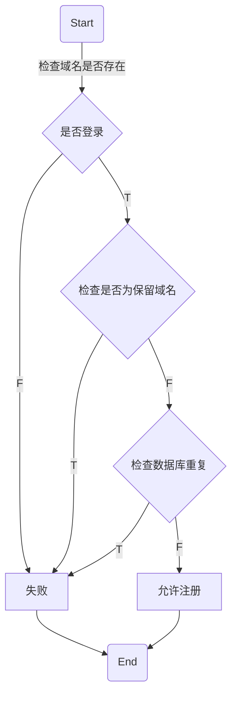
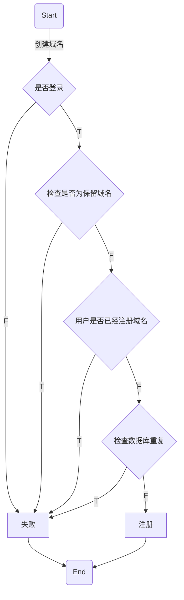
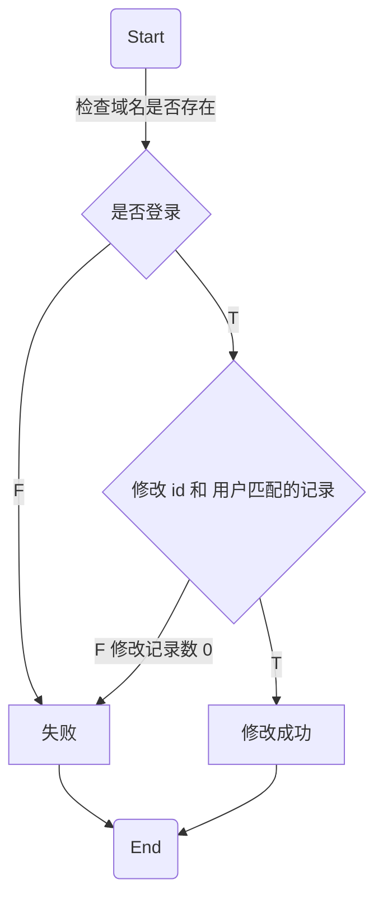

今天是 2022 年 2 月 2 日，距离今年的情人节只有不到两周的时间了。

给大家隆重介绍一个网站，[憨憨.我爱你](https://xn--wkua.xn--6qq986b3xl/)

参考示例网站：

- [表白幻灯片.憨憨.我爱你](https://xn--owtp31bqkbezhj50a.xn--wkua.xn--6qq986b3xl/)
  - [源码](https://github.com/willin-love/romantic_page)
- [恋爱计时器.憨憨.我爱你](https://xn--m7rx3unue2vok44a.xn--wkua.xn--6qq986b3xl/)
  - [源码](https://github.com/willin-love/romantic_page)

# 申请流程

打开官网首页： [憨憨.我爱你](https://xn--wkua.xn--6qq986b3xl/)

（由于该网站数据库使用的是 PlanetScale 免费服务，位于美东，所以访问可能会稍微有点慢。请耐心等待。）


使用 [Authing](https://www.authing.cn/?utm_source=v0&utm_campaign=hanhan) 账号登录（可以手机、邮箱注册，Github 账号登录，或者微信小程序扫码，后续还会添加更多登录方式）。


可以分别点击进入域名申请和邮箱申请。

## 域名申请

域名申请界面如下：


支持的绑定方式有三种：

- CNAME： 可以使用 Github Pages、 Netlify、 Gitee、 Coding.net、 Cloudflare 等提供托管服务的平台
  - 值参考： `willin.github.io`
  - 注意： 不支持 Vercel ，因为 Vercel 默认情况下并不支持绑定二级域名（除非所有权在你个人名下）
- A： IPv4 需要自己搭建服务器，并进行绑定
  - 值参考： `1.2.3.4` （你服务器的 ip 地址）
- AAAA: IPv6 需要自己搭建服务器，并进行绑定
  - 不做表述，不太推荐非专业人士选择
  - 如果你需要同时绑定 IPv4 和 IPv6 的话，建议建议注册 A 类型，然后 ISSUE 或邮件联系我配合处理

其中还有一项 Proxied（CDN），如果不知道作用，可以尝试开启或关闭来测试。

## 邮箱申请

域名申请界面如下：


目前使用了 Cloudflare 的邮件转发服务，但由于暂不支持 IDN 域名，所以可以提前抢注，第一时间拥有。

## 其他说明

### 如需帮助

欢迎在 Github 上关注我： [willin](https://github.com/willin) ，如果在为心爱的她准备礼物时遇到问题，可以为你免费提供技术咨询。

### 还想要其他的域名

- [js.cool](https://github.com/js-cool) （在多次协商后，目前已经支持 Vercel 绑定）
- log.lu （敬请期待）

### 感觉慷慨

- 您可以将该网站分享给更多的人
- 您也可以通过以下渠道进行打赏：
  - [微信](https://willin.github.io/images/wx.png)
  - [支付宝](https://willin.github.io/images/alipay.png)
  - [爱发电](https://afdian.net/@willin)
  - [Github Sponsors](https://github.com/sponsors/willin)
  - [Paypal](https://www.paypal.com/paypalme/willinwang)

### 跃跃欲试

或许你也有很多想法，想要实现。您可以：

- 使用 [Authing](https://www.authing.cn/?utm_source=v0&utm_campaign=hanhan) 快速集成开发你自己的应用
- Fork 本项目源码（完全开源），并提供你自己的域名服务
  - [项目源码](https://github.com/willin/xn--wkua.xn--6qq986b3xL)
- 在 Github 上对本项目进行完善和优化
  - [项目后续规划](https://github.com/willin/xn--wkua.xn--6qq986b3xL/issues/3)

---

# 开源

接下来，开始一个重要的环节。俗话说，授人以鱼不如授人以渔。我将 [憨憨.我爱你 的源码](https://github.com/willin/xn--wkua.xn--6qq986b3xL) 进行开源，并详细讲解一下设计与实现的全部过程。

## 设计

这个项目大概花了我 3 个小时左右完成。为了扬长避短，我使用了 UI 框架，所以就没有额外的 UI 设计了，直接用几个基础组件快速上手该项目。

### 技术选型

首先，第一步是技术选型。因为我要提供的是一项免费的服务，所以尽量也选择一些免费的服务商，及一些相关的技术栈。

服务商的选择：

- [Cloudflare](https://www.cloudflare.com/)： 提供免费的域名解析、CDN 加速以及开放的接口
- [Vercel](https://vercel.com/)： 面向个人的免费应用托管，支持 Node.js 环境，使用 Next.js 框架
- [PlanetScale](https://planetscale.com)： 具有一定免费额度的云端 MySQL 服务
- [Prisma](https://www.prisma.io/)： Cloud Studio 管理数据库

其实，本来是想使用 Cloudflare 全家桶的，就是用 [Cloudflare Pages](https://pages.cloudflare.com/) （静态网站） + [Cloudflare Workers](https://workers.cloudflare.com/) （Serverless 方法执行）及 [KV](https://developers.cloudflare.com/workers/learning/how-kv-works) （键值对存储），但是由于时间和精力的限制，所以就采用了更简单快捷的实现方式。

技术栈：

- [Typescript](https://www.typescriptlang.org/)： 虽然我喜欢用更少的代码做更多的事情，但 TS 带给我更高效的团队协作舞台
- [Next.js](https://nextjs.org/)： 一个全栈框架（前端使用 React，后端类似于 http 模块和 Express），支持 SSR（服务器端渲染）和 SSG（静态站点生成）
  - [@authing/nextjs](https://github.com/Authing/authing-nextjs)： Authing SSO 集成 SDK
- [Prisma](https://www.prisma.io/)： 下一代的 ORM 框架，支持多种数据库（本项目使用为 MySQL）和数据库迁移（Migration）
- [Tailwind CSS](https://tailwindcss.com/)： 下一代的 CSS 框架，实用第一
  - [Daisy UI](https://daisyui.com/)：封装了一些 UI 样式组件

### 数据库设计

由于我用的是 [Authing](https://www.authing.cn/?utm_source=v0&utm_campaign=hanhan) 用户集成，所以省去了用户表的设计和用户相关接口的设计。

```prisma prisma/schema.prisma
// 域名类型
enum DomainType {
  A
  AAAA
  CNAME
}

// 审核状态
enum Status {
  // 待审核
  PENDING
  // 激活
  ACTIVE
  // 已删除
  DELETED
  // 被管理员禁用
  BANNED
}

// 域名记录表
model Domains {
  // Cloudflare 域名记录的 ID，同时作为表主键 id
  id        String      @id @default(cuid()) @db.VarChar(32)
  // 自增 id，没有什么实际意义，只是为了减少查询（毕竟有调用配额限制），实际项目中不推荐自增主键及自增 id 使用
  no        Int         @default(autoincrement()) @db.UnsignedInt
  name      String      @db.VarChar(255)
  punycode  String      @db.VarChar(255)
  type      DomainType  @default(CNAME)
  content   String      @default("") @db.VarChar(255)
  proxied   Boolean     @default(true)
  // Authing 的用户 id
  user      String      @default("") @db.VarChar(32)
  status    Status      @default(ACTIVE)
  createdAt DateTime    @default(now())
  updatedAt DateTime    @updatedAt

  @@index([no])
  @@index([name, punycode])
  @@index([user, status, createdAt])
}

// 邮箱表
model Emails {
  // 由于 Cloudflare 邮箱还没有提供开放接口，所以需要人工审核和操作，这里会填入默认的 cuid 作为主键 id
  id        String      @id @default(cuid()) @db.VarChar(32)
  // 自增 id，没有什么实际意义，只是为了减少查询（毕竟有调用配额限制），实际项目中不推荐自增主键及自增 id 使用
  no        Int         @default(autoincrement()) @db.UnsignedInt
  name      String      @db.VarChar(255)
  punycode  String      @db.VarChar(255)
  content   String      @default("") @db.VarChar(255)
  user      String      @default("") @db.VarChar(32)
  status    Status      @default(PENDING)
  createdAt DateTime    @default(now())
  updatedAt DateTime    @updatedAt

  @@index([no])
  @@index([name, punycode])
  @@index([user, status, createdAt])
}
```

非常简单，参考注释说明。另外，我本来是打算只存一个名称的，但由于会重复注册，比如说我注册了一个中文名`老王`，你又注册了一个对应的 punycode 代码名 `xn--qbyt9x`，就会冲突，所以索性（偷懒）都存下吧。

### 技术准备

- 中文域名需要掌握的 Punycode 知识： [RFC 3492](https://www.rfc-editor.org/rfc/inline-errata/rfc3492.html) 规范
- Cloudflare [API 接口](https://developers.cloudflare.com/api/)
  - 创建一条解析： [Create DNS Record](https://api.cloudflare.com/#dns-records-for-a-zone-create-dns-record)
  - 修改一条解析： [Patch DNS Record](https://api.cloudflare.com/#dns-records-for-a-zone-patch-dns-record)
  - 删除一条解析： [Delete DNS Record](https://api.cloudflare.com/#dns-records-for-a-zone-delete-dns-record)
- Authing SSO 集成，可以参考我之前的文章： [《全栈框架应用快速集成 Authing SSO》](https://willin.wang/posts/authing-full-stack)

先把 Next.js 网站框架搭建起来，部署到 Vercel 上进行测试。可以再加上 Tailwind CSS 和 Authing SSO 集成。第一步准备工作就算完成了。

### 接口设计

为了快速（偷懒）实现，我分别创建了增删改查四个接口。

查询接口：

[](https://mermaid.live/edit#pako:eNqrVkrOT0lVslJKL0osyFAIcYnJUwCC4JLEohJDDTClCRHS1bVTqHm2uOHZ_KVP589_OqH32Yz1Tycse7p2xtM5K2oUkjNSk7MNqyGCz2fufrp3ai2SRrcahbTEzBzD6KdLNr7YsjQWIeWal2KoASSg1kDMgWgKgRlrVA2xGGL6kx27nuyf-3zqTIg7kK0JgVqDbJYR3AUQvjHMsKkbnvWue7pr8sv23qdLCBpjDDemuDQ5ObW4GOiX1sYX63Y827ziaVsPmo-UdJRyU4tyEzNTgGFbDZKLUSrJSM1NjVGyAjLT8otSi0tilGLyaoEqSwtSEktSXVMyS_KLlKxKikpTdZQSS0vygyvzkmF8iBqXzERgROUqWaUl5hQDRQsS86Ly82H8WgBDk7eI)



创建接口：

[](https://mermaid.live/edit#pako:eNqrVkrOT0lVslJKL0osyFAIcYnJUwCC4JLEohIjDTClCRHS1bVTqHnaMfvp7l1P589_OqG3RiE5IzU526j62Yz1Tycsez5z99O9U2uRFLvVKKQlZuYYRT9dsvHFlqWxCCnXvBQjDSABNRpiDkRTCMxYoLmLG57NXwox_cmOXU_2z30-dSbEbmRrQqDWIJtlBHcBhG9c_XzKimcd2yGGPd2-6fnu_mebVzxt6yHOPGM080xgjpu64Vnvuqe7Jr9s7326hKAxJnBjikuTk1OLi42iIa5ACxslHaXc1KLcxMwUYMxUg-RilEoyUnNTY5SsgMy0_KLU4pIYpZi8WqDK0oKUxJJU15TMkvwiJauSotJUHaXE0pL84Mq8ZBgfosYlMxEYzblKVmmJOcVA0YLEvKj8fBi_FgBYpc7Y)



数据库查询用户是否已经注册域名和是否存在同名可以用一次查询完成，这里为了提高查询性能进行了拆分。

修改接口：

[](https://mermaid.live/edit#pako:eNqrVkrOT0lVslJKL0osyFAIcYnJUwCC4JLEohJjDTClCRHS1bVTqHm2uOHZ_KVP589_OqH32Yz1Tycse7p2xtM5K2oUkjNSk7ONqyGCz2fufrp3ai2SRrcahbTEzBzj6KdLNr7YsjQWIeWal2KsASSg1kDMgWgKgRlrVP1k_7pnU3YqZKYoPJ3Uo_B8yopnHduf9ux82dr7fFbLi3Ub0K1TgGiAyDybukHBAOoAZFuM4NYUlyYnpxYXG0dDtD3rmPC0az6aI5V0lHJTi3ITM1OAwVUNkotRKslIzU2NUbICMtPyi1KLS2KUYvJqgSpLC1ISS1JdUzJL8ouUrEqKSlN1lBJLS_KDK_OSYXyIGpfMRGDY5ypZpSXmFANFCxLzovLzYfxaAEOiqXQ)



删除接口与修改接口同。邮箱接口与域名类似，不再赘述。

## 代码实现

### 封装 Cloudflare SDK

当然也有现成的库可以直接用，但是因为没几行代码，我就自己手撸了。

```ts src/lib/cloudfalre.ts
import { Domains } from '@prisma/client';
import { CfAPIToken, CfZoneId } from '../config';

const BASE_URL = 'https://api.cloudflare.com/client/v4';

export type CFResult = {
  success: boolean;
  result: {
    id: string;
  };
};

const headers = {
  Authorization: `Bearer ${CfAPIToken}`,
  'Content-Type': 'application/json'
};

export const createDomain = async (form: Pick<Domains, 'name' | 'content' | 'type' | 'proxied'>): Promise<string> => {
  const res = await fetch(`${BASE_URL}/zones/${CfZoneId}/dns_records`, {
    method: 'POST',
    headers,
    body: JSON.stringify({ ...form, ttl: 1 })
  });
  const data = (await res.json()) as CFResult;
  if (data.success) {
    return data.result.id;
  }
  return '';
};

export const updateDomain = async (
  id: string,
  form: Pick<Domains, 'name' | 'content' | 'type' | 'proxied'>
): Promise<boolean> => {
  const res = await fetch(`${BASE_URL}/zones/${CfZoneId}/dns_records/${id}`, {
    method: 'PATCH',
    headers,
    body: JSON.stringify({ ...form, ttl: 1 })
  });
  const data = (await res.json()) as CFResult;
  console.error(data);
  return data.success;
};

export const deleteDomain = async (id: string): Promise<boolean> => {
  const res = await fetch(`${BASE_URL}/zones/${CfZoneId}/dns_records/${id}`, {
    method: 'DELETE',
    headers
  });
  const data = (await res.json()) as CFResult;
  return !!data.result.id;
};
```

### 封装校验工具类

需要有一定的正则基础，如果你需要在线调试工具，可以访问： [regexper.js.cool](https://regexper.js.cool/)

域名（CNAME）校验正则：

```js
/^((?!-))(xn--)?[a-z0-9][a-z0-9-_]{0,61}[a-z0-9]{0,1}\.(xn--)?([a-z0-9-]{1,61}|[a-z0-9-]{1,30}\.[a-z]{2,})$/;
```

邮箱校验正则：

```js
/^[a-z0-9!#$%&'*+/=?^_`{|}~-]+(?:\.[a-z0-9!#$%&'*+/=?^_`{|}~-]+)*@(?:[a-z0-9](?:[a-z0-9-]*[a-z0-9])?\.)+[a-z0-9](?:[a-z0-9-]*[a-z0-9])?$/;
```

IPv4 校验正则：

```js
/^((25[0-5]|2[0-4][0-9]|[01]?[0-9][0-9]?)\.){3}(25[0-5]|2[0-4][0-9]|[01]?[0-9][0-9]?)$/;
```

IPv6 校验正则：

```js
/^((([0-9A-Fa-f]{1,4}:){7}([0-9A-Fa-f]{1,4}|:))|(([0-9A-Fa-f]{1,4}:){6}(:[0-9A-Fa-f]{1,4}|((25[0-5]|2[0-4][0-9]|1[0-9][0-9]|[1-9]?[0-9])(\.(25[0-5]|2[0-4][0-9]|1[0-9][0-9]|[1-9]?[0-9])){3})|:))|(([0-9A-Fa-f]{1,4}:){5}(((:[0-9A-Fa-f]{1,4}){1,2})|:((25[0-5]|2[0-4][0-9]|1[0-9][0-9]|[1-9]?[0-9])(\.(25[0-5]|2[0-4][0-9]|1[0-9][0-9]|[1-9]?[0-9])){3})|:))|(([0-9A-Fa-f]{1,4}:){4}(((:[0-9A-Fa-f]{1,4}){1,3})|((:[0-9A-Fa-f]{1,4})?:((25[0-5]|2[0-4][0-9]|1[0-9][0-9]|[1-9]?[0-9])(\.(25[0-5]|2[0-4][0-9]|1[0-9][0-9]|[1-9]?[0-9])){3}))|:))|(([0-9A-Fa-f]{1,4}:){3}(((:[0-9A-Fa-f]{1,4}){1,4})|((:[0-9A-Fa-f]{1,4}){0,2}:((25[0-5]|2[0-4][0-9]|1[0-9][0-9]|[1-9]?[0-9])(\.(25[0-5]|2[0-4][0-9]|1[0-9][0-9]|[1-9]?[0-9])){3}))|:))|(([0-9A-Fa-f]{1,4}:){2}(((:[0-9A-Fa-f]{1,4}){1,5})|((:[0-9A-Fa-f]{1,4}){0,3}:((25[0-5]|2[0-4][0-9]|1[0-9][0-9]|[1-9]?[0-9])(\.(25[0-5]|2[0-4][0-9]|1[0-9][0-9]|[1-9]?[0-9])){3}))|:))|(([0-9A-Fa-f]{1,4}:){1}(((:[0-9A-Fa-f]{1,4}){1,6})|((:[0-9A-Fa-f]{1,4}){0,4}:((25[0-5]|2[0-4][0-9]|1[0-9][0-9]|[1-9]?[0-9])(\.(25[0-5]|2[0-4][0-9]|1[0-9][0-9]|[1-9]?[0-9])){3}))|:))|(:(((:[0-9A-Fa-f]{1,4}){1,7})|((:[0-9A-Fa-f]{1,4}){0,5}:((25[0-5]|2[0-4][0-9]|1[0-9][0-9]|[1-9]?[0-9])(\.(25[0-5]|2[0-4][0-9]|1[0-9][0-9]|[1-9]?[0-9])){3}))|:)))(%.+)?$/;
```

### 页面请求封装

以域名注册提交为例：

```ts src/components/domain/create.tsx focus=3:6,23:24,31:32
async function submit(e: SyntheticEvent) {
  e.preventDefault();
  // 因为我 Vue、 React 都会用，且用的都比较少
  // 所以获取表单数据，我用的是 Vanilla JS 方式，通用性更高
  // 如果你不熟悉，可以用 React 的方式
  const target = e.currentTarget as typeof e.currentTarget & {
    type: { value: DomainType };
    content: { value: string };
    proxied: { checked: boolean };
  };
  const type = target.type.value;
  const content = target.content.value;
  if (!validateContent(type, content)) {
    return;
  }
  const form = {
    type,
    content,
    proxied: target.proxied.checked,
    name,
    punycode: toASCII(name)
  };
  // 我建议对 Fetch 进行封装，为了追求效率（偷懒），我就没有做
  const res = await fetch(`/api/domain/create`, {
    method: 'POST',
    body: JSON.stringify(form),
    headers: {
      'content-type': 'application/json'
    }
  });
  // 所以像这样的处理，就非常不优雅，而且还可以统一封装，将错误提示使用通知条组件之类的
  const result = (await res.json()) as { success: boolean; id: string };
  if (result.success) {
    router.reload();
  } else {
    alert('出错啦！请稍后重试');
  }
}
```

可复用的代码可以进行封装。参考软件工程的思想：高内聚、低耦合。我这里举的是一个较为反面的教材，代码臃肿、可读性低。

### 注意点

- 由于 Tailwind CSS 3 采用了全新的 JIT 机制，purgecss 不再需要
- 关注 React 性能，如 `useState` 之类的 Hooks，尽量放在页面级别，不要放在组件级别（尤其是会循环生成的组件）
- 使用 `useMemo` 、 `debounce` 之类的方式进行缓存、防抖、限流，以提升应用性能
- 使用 Next.js 框架（或普通 React 应用）时，大部分情况下，多了解 `swr` 及其内部的一些核心思想会很有裨益

剩下的代码部分就枯燥且简单了。

---

差不多就讲这么多吧。记得分享哦！

[willin](https://github.com/willin) | [憨憨.我爱你](https://xn--wkua.xn--6qq986b3xl/) | [项目源码](https://github.com/willin/xn--wkua.xn--6qq986b3xL)
